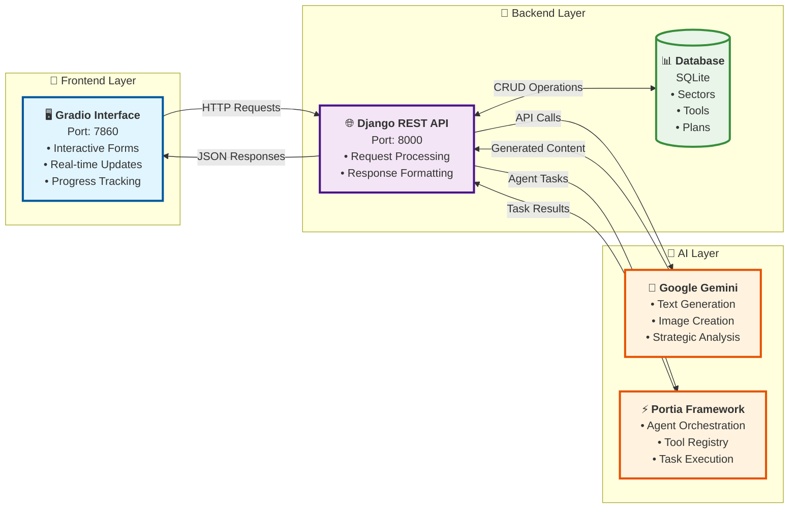

# 🚀 AI Strategy Builder

<div align="center">


**Transform Your Ideas Into Actionable Strategies with AI**

[](https://hackgradio.onrender.com/gradio/)

</div>

---

## 🎯 What It Does

**AI Strategy Builder** is an intelligent AI-powered platform that transforms your raw business ideas into comprehensive, actionable strategic plans. Whether you're an entrepreneur with a startup concept, a business professional planning a new initiative, or a student working on a project, HackAgent guides you through a structured 3-step process:

### 🔄 The 3-Step Strategy Pipeline

1. **💡 Ideate & Enhance** - Input your idea → AI generates multiple enhanced strategic versions
2. **📋 Generate Plan** - Select your preferred concepts → AI creates detailed execution roadmaps  
3. **⚡ Execute & Track** - AI agents perform real tasks like image generation, research, and content creation

### ✨ Key Capabilities

- 🧠 **Multi-Domain Intelligence**: Marketing, Research, Sales, Product, Content, Technology
- 🎨 **AI Content Generation**: Creates images, marketing materials, and strategic documents
- 📊 **Structured Planning**: Detailed timelines, resource allocation, and success metrics
- 🤖 **Automated Execution**: AI agents perform real-world tasks based on your strategy
- 🎛️ **Interactive Interface**: Beautiful, user-friendly Gradio UI with real-time feedback

---

## 🌟 Inspiration

As builders who love rapid prototyping, we constantly face the same problem: **great ideas die in the planning phase**. You have a spark of inspiration, but turning it into something executable feels overwhelming and slow.

**AI Strategy Builder was built for fast execution** - we wanted to eliminate the weeks spent on research, planning, and preparation. Instead of getting stuck in analysis paralysis, you can go from idea to actionable plan to actual execution in minutes, not months.

This is for the builders, the makers, the people who want to **ship fast and iterate faster**.

---

## D Video
[DEMO](demo.mp4)

## 🛠️ How We Built It

### 🏗️ Architecture Overview




### 🧩 Technology Stack

**Frontend & UI**
- **Gradio**: Python-based interactive web interface with custom CSS styling

**Backend & API**
- **Django REST Framework**: Robust Python web framework with RESTful APIs
- **SQLite**: Flexible database layer for sectors, tools, and plans
- **CORS Support**: Cross-origin requests for frontend integration

**AI & Machine Learning**
- **Google Gemini 2.0 Flash**: Latest multimodal AI for text and image generation
- **Portia Framework**: Advanced AI agent orchestration and execution
    - **Custom Tool Registry**: Specialized business intelligence tools
- **Prompt Engineering**: Domain-specific prompt optimization

**Infrastructure & Deployment**
- **Render**: Cloud hosting with automatic scaling
- **Docker**: Containerized deployment for consistency
- **Environment Management**: Secure API key and configuration handling

### 🔧 Core Components

1. **StrategyBuilder Class** - Central business logic orchestrator
2. **Sector Management** - Dynamic domain classification and tool selection  
3. **AI Prompt Enhancement** - Intelligent prompt transformation and augmentation
4. **Plan Generation Engine** - Structured strategy creation with templates
5. **Agent Execution System** - Automated task performance with real outputs

---

## 🚀 Getting Started

### 📋 Prerequisites

- **Python 3.8+** 
- **pip** (Python package installer)
- **Git** 
- **Google API Key** (for Gemini AI)
- **Portia API Key** (for advanced AI agents)

### ⚡ Quick Start

1. **Clone & Setup**
```bash
git clone https://github.com/yourusername/HackAgent.git
cd HackAgent
python -m venv venv
source venv/bin/activate  # Windows: venv\Scripts\activate
```

2. **Install Dependencies**
```bash
cd backend
pip install -r requirements.txt
```

3. **Environment Configuration**
```bash
# Create .env file
echo "GOOGLE_API_KEY=your_gemini_api_key" > .env
echo "PORTIA_API_KEY=your_portia_api_key" >> .env
echo "SECRET_KEY=your_django_secret_key" >> .env
```

4. **Database Setup**
```bash
python manage.py migrate
python populate_tools_script.py  # Load initial data
```

5. **Launch Application**
```bash
# Terminal 1: Start Django API
python manage.py runserver 0.0.0.0:8000

# Terminal 2: Start Gradio UI
python gradio_ui.py
```

6. **Access Your App**
- **Gradio Interface**: http://localhost:7860
- **API Endpoints**: http://localhost:8000/api/

### 🌐 Live Demo

Experience HackAgent instantly: **[hackagent.onrender.com](https://hackagent.onrender.com)**

---

## 🎮 How to Use

### 1️⃣ Select Your Domain & Input Idea
- Choose from **Marketing, Research, Sales, Product, Content, Technology**
- Describe your vision in natural language
- Example: *"Launch a sustainable marketing campaign for eco-friendly products targeting millennials"*

### 2️⃣ AI Enhancement Magic
- Click "✨ Enhance My Idea" 
- AI generates 5-8 strategic variations of your concept
- Select the enhanced prompts that resonate with your vision

### 3️⃣ Strategic Plan Generation  
- AI creates comprehensive plans with:
  - **Executive Summary** with key objectives
  - **Detailed Steps** with timelines and resources
  - **Success Metrics** and KPIs
  - **Risk Assessment** and mitigation strategies

### 4️⃣ Automated Execution
- AI agents perform real tasks:
  - Generate marketing images and visuals
  - Create content and copy
  - Conduct market research
  - Develop implementation timelines

---

## 🏆 What Makes It Special

### 🎨 **Creative AI Integration**
Unlike traditional planning tools, HackAgent uses **creative AI** to:
- Generate unexpected strategic angles
- Create visual assets on-demand
- Provide industry-specific insights
- Suggest innovative approaches you might not consider

### 🔄 **End-to-End Automation**
From initial concept to executable tasks:
- **Ideation** → **Enhancement** → **Planning** → **Execution**
- No context switching between different tools
- Seamless workflow for rapid prototyping

### 🎯 **Domain Expertise**
Pre-trained on business strategies across:
- **Marketing**: Campaign development, brand positioning, customer acquisition
- **Product**: Development roadmaps, feature prioritization, market fit
- **Research**: Methodology design, competitive analysis, market insights
- **Technology**: Implementation strategies, tech stack selection